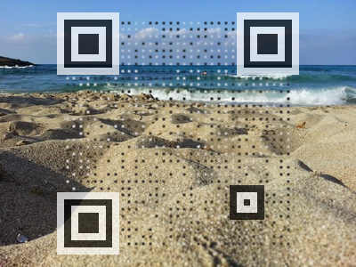

---

# 🎨✨ QR Code Image Merger

Merge beautiful background images with **fully functional** QR codes — seamlessly and with style!  
Only the parts of the image that *need* to change will be touched 🧠🖼️

---

### 🧪 What It Does

Turn this:

Into a **scan-ready** QR code that still looks like your original image!  
✅ Works with any QR scanner — go ahead, give it a try!  

---

### 📦 Dependencies

- 🧬 **QR Code Generator**  
  [`qrcode-generator`](https://github.com/kazuhikoarase/qrcode-generator) – for generating the QR code.

- 🧠 **QR Code Verifier**  
  [`jsqrcode`](https://github.com/LazarSoft/jsqrcode) – for verifying that the QR is still valid.

---

Let me know if you'd like a dark-themed version or want to embed badges, usage examples, or GitHub stats!